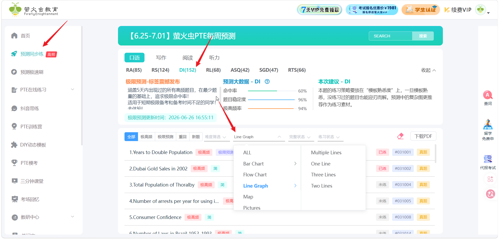
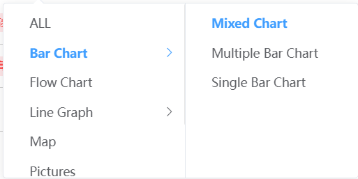
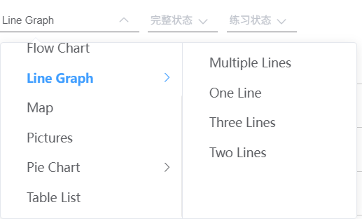

备考要点：

1、找到合适的模版，对自己来说易读易背的模版

2、一生只背一个模版，背的熟才是王道

3、了解 DI 所有的题型以及应该用哪个模版

4、DI  题型分列

​       数据类：line chart、bar chart、pie chart、table list

​       流程类：flow

​       图片类：picture、map

6、在萤火虫PTE去观看每种题型的解题思路视频



5、我总结了 4 套模版，如遇到多维度，应该使用 **极值多分类模版**

- 极值模版-单分类 （table 、 map 、 line chart 、bar chart 、pie chart）
- 极值模版-多分类 （table 、map 、 line chart 、bar chart 、pie chart）
- 流程图模版
- 图片模版       (图片、地图)







**极值模版-单分类** （table 、 map 、 line chart 、bar chart 、pie chart）

```JS
this line chart shows information about 标题.

overall,we can see a clear trend and noticeable differences in the data.

Firstly,the highest number can be found in 最大项目，
           which is around 最大数值.
           
Secondly,the second highest number is located in 第二大项目,
           which is about 第二大数值.
           
Furthermore,其他项目1 and 其他项目2 also carry important weight
in this graph.

In summary,this chart uses real data to describe 标题.

```

**极值模版-多分类** （table 、map 、 line chart 、bar chart 、pie chart）

```JS
this line chart shows information about 标题.

if you look at 分类1,
    the highest number can be found in 分类1最大项目，
                     which is aound 分类1最大数值,
                         
    the lowest figure is located in 分类1最小项目，
                     which is about 分类1最小数值.
                     
if you look at 分类2，
    the highest number is 分类2最大项目，
                     and the number is around 分类2最大数值.
                     
Furthermore,
    其他任意项目1 and 其他任意项目2 also carry important weight in this graph.
    
In summary,this chart uses real data to describe 标题.
           
```

**流程图模版**

```JS

This flow charts shows information about 标题.

According to the picture we can see that 

Firstly,the process starts from the first stage,
                        which is called step1.
                        
Secondly,it gose to the second stage,
                        which is about step2.

Thridly,it comes to the third stage,
                        which is called step3.

Furthermore,the process comes to the ending point,
                        which is about END，
                        
In summary,the process shows details about 标题.
 
```

**图片模版**       (图片、地图)

```JS
This map shows information about 标题.

if you look at 图片1/方位1，
    the most obvious information given here is ___,
        
Next to it,
    we can see ___ and ___,
    and these two elements are also quite important.

If you look at 图片2/方位2,
    ___ and ___ are also shown in this part,
    giving a better understanding about this picture.
    
Furthermore,
    we can also see ___ and ___ in this picture as well.
    
In summary,
    this picture uses different elements to describe 标题.
    
```

