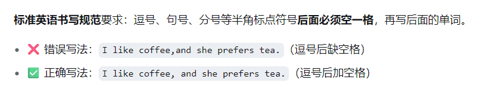
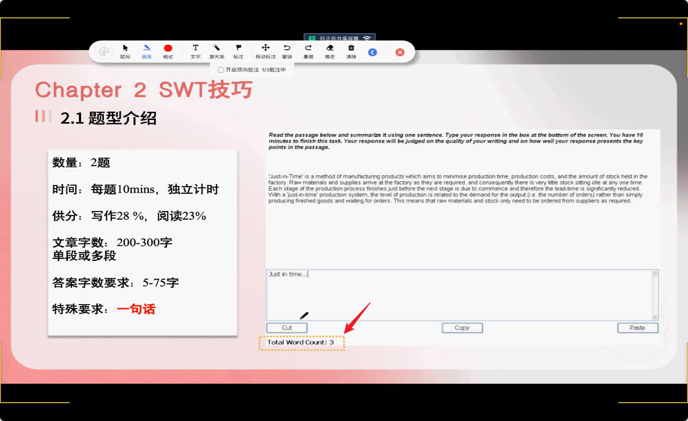
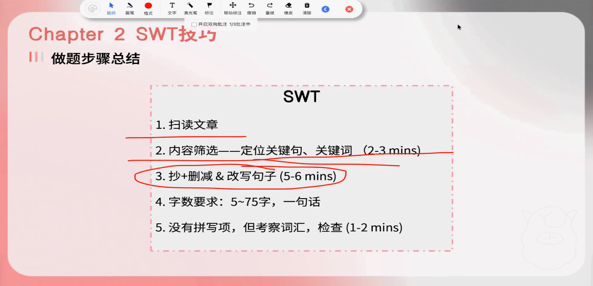
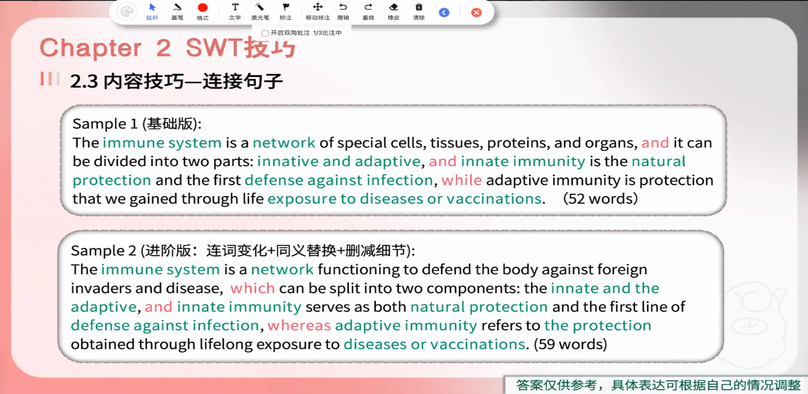

# SWT做题策略

1、务必不要超过 **75** 个字，左下方有字数统计，注意观察

2、务必不要出现两个 **句号**，否则直接 0 分

3、必须使用连词/关系词连接句子

4、每个连词之间必须是完整的一句话

5、有且只有一个句号

6、首字母大写，结尾句号

7、评分纬度：内容、格式、语法、词汇

8、无法复制原文，只能复制自己打出来的字

9、不能使用 however、therefore，否则判定语法错误

10、连词之前需要有空格，否则扣分

11、在了解做题规则和做题策略之后，自己去做几道模拟题

